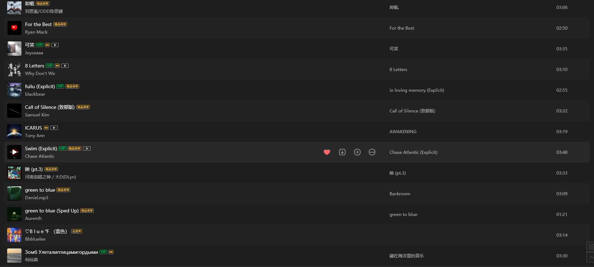

## 我说音乐是回忆的媒介

> 没有音乐，就退化耳朵；没有戒律，就灭掉烛火                                                                                                    ------《路边野餐》

最近走在路上听歌时，突然被歌单里随机播放的一首曲子引起了回忆。我现在已经记不清是关于什么的记忆了，但是这让我想到了一个有意思的命题（我觉得我可以把它给写出来）------音乐是回忆的媒介。

### 歌曲的记忆

仔细想一想，这的确是一件有意思的事情。我的歌单里面差不多有500首歌，我都在这些歌中注入了我的记忆，那这也算是一种回忆录了。就比如：我在听《Virgin Marry》时，总能想起高中的一些生活，听《Children of Machine》时，我脑中的画面十分清晰：在一片雪地中，从学校操场旁的小路上走回寝室.......这种类似的歌曲有很多，它们像是时间胶囊，每当它们在我的耳机中回响时，我都像穿越了一般，将我那时的心境代入到了现在的我。但我的生活并不总是像回忆般温馨，所以有些歌被我注入了负面的情感，最明显的应该是《Is it Just Me》这首歌，我得承认这首歌确实很好听，但是我听到它时是我高考失利的那段时期，所以我其实是挺抗拒听这首歌的。

我不知道这种事情是不是在所有人身上都会发生，音乐的确有着调动人们情感的作用，我假设这种将记忆赋予音乐的行为是我们每个人潜意识里的习惯，那么这件事就变得更有意思了。每个人看着歌单就能讲出很多故事，一些开心的，糟心的，难过的回忆能够随着音节和韵律表达出来，我认为这也是音乐予我们美好的地方。

### 音乐类型的表象特征

其实这是一篇比较感性的文章，但是我实在想不出来什么感性的副标题了:(

还有一种现象就是，我会在一个特定的时间内钟情于某一种歌曲类型。再举个例子吧，大一下那段经常去图书馆的日子里，由于周遭的安静氛围，我的歌单中几乎都是纯音乐类的轻柔舒缓的音乐。一个时段所感兴趣的音乐也在很大程度上反映了人们当时的处境。这里分享一些大一时候的收藏歌单，也许你能看出我当时的心境。

- 大约是在23年23月的歌单

这段时期的我经常在图书馆，所以大多数的歌都很舒缓，其中有一首歌是我特别喜欢的，就是第三行的"Eppure Sentire"， 这是一首意大利语的歌曲，题目的意思是“仍然记得”。这首歌十分空灵，让我能很好的在安静的环境下专注于我正在做的事。

- 大约是24年5月的歌单

  

这段时间由于要准备转专业考试和期末考试，加上那些天比较累，所以我尽是收藏了些纯音乐。其中的8Letters真的很好听，第一次听到时耳朵都被惊艳到了，这里不得不摆出我耳朵当时的表情了。

仔细找了找，可能是因为我比较喜欢较为舒缓和轻柔的音乐，所以我的歌单里并没有说明很欢快的歌。有是有，但只是零散地分布在各个时间段的角落。通过这些歌曲能看到我在各个时间段的心境，也能看到我是个喜欢怎样歌曲风格的人，进而能稍微看出来我的喜好。人们说“字如其人”，但是我更倾向于“曲如其人”。

## 曲如其人

一个人的听歌风格或多或少的会反映出这个人的性格特征，例如：喜欢听轻柔舒缓曲风的人，会更倾向于拥有安静的温馨环境；爱好说唱，流行乐的人，可能更偏好感受新鲜感.......但一个人并不是一成不变的，而性格的变化也能通过曲风偏好反映。又拿我举例子了，我在高中的时候喜欢听说唱类型的曲目，尤其是欧美说唱，那段时间的我总想着做些什么，而不是像我现在一样喜欢停下来思考自己。歌曲总能展现出当下最真实的我们，或许你并不这么想，但是在众多乐曲曲目中，选择了其中一个风格总是有原因的。也许在成长中我们会发生改变，但在看到之前的歌单的时候，我们总能回想起当年的自己。这也是一件很有意思的事情。

- 高中时期的歌单，那时候喜欢用网易云，大学才改用企鹅（其实我是想尝试使用spotify的，但是没有渠道充值，于是作罢）

（当时的孤勇者还不是小学生专属，我是看了双城之战才知道这首歌的），当时很喜欢Polo G，小果汁，X，iann dior还有LAROI，所以我收藏了很多他们的歌。看到当年的歌单也能多少回忆起当时那个天真的自己。

## 写在最后

噢噢噢，对了，我还有几首我特别喜欢的歌，写在这里吧。

- 《I Really Want to Stay at Your House》 赛博朋克的主题曲之一 （听着就回忆起以前玩2077的日子，那真是一款好游戏啊）

- 《Burning Vow 誓焰》 小露的宣传主题曲 （让我回忆起小露死时的那种无奈和落寞 :(  ）
- 《After Dark》 极具上世纪8，90年代美国风格的歌曲  ，听着我觉得自己就是高司令（bro以为自己是高司令）
- 《Can We Kiss Forever》 一首空灵的歌曲 （让我觉得我在一艘船舰上航行于白令海峡）
- 《Love in The Dark》 阿黛尔的一首神曲  （但是我其实跟喜欢翻唱版的）

能想到的就这么多了，这些加上上面说过的，都是对我带有强烈回忆色彩的歌曲。我从歌曲中获取了无限的能量，我不知道没有音乐的世界会发生什么。也许真的像《路边野餐》中写到的：没有音乐，就退化耳朵。

祝听歌愉快 :)

24/12/10